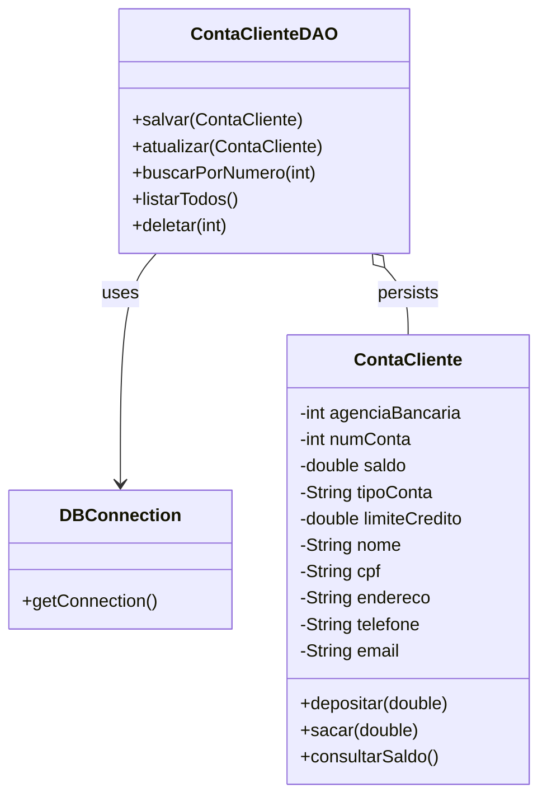

```mermaid
classDiagram
    class ContaCliente {
        -int agenciaBancaria
        -int numConta
        -double saldo
        -String tipoConta
        -double limiteCredito
        -String nome
        -String cpf
        -String endereco
        -String telefone
        -String email
        +depositar(double)
        +sacar(double)
        +consultarSaldo()
    }

    class ContaClienteDAO {
        +salvar(ContaCliente)
        +atualizar(ContaCliente)
        +buscarPorNumero(int)
        +listarTodos()
        +deletar(int)
    }

    class DBConnection {
        +getConnection()
    }

    ContaClienteDAO --> DBConnection : uses
    ContaClienteDAO o-- ContaCliente : persists
```
